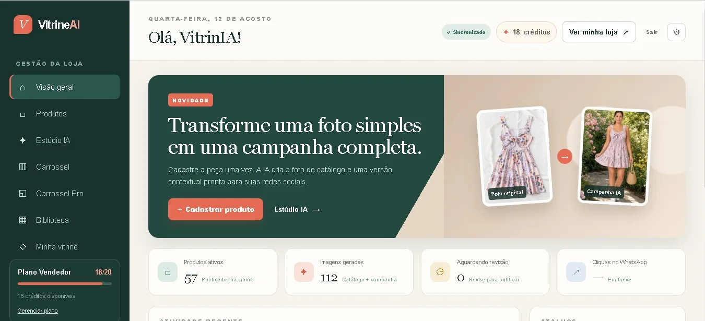
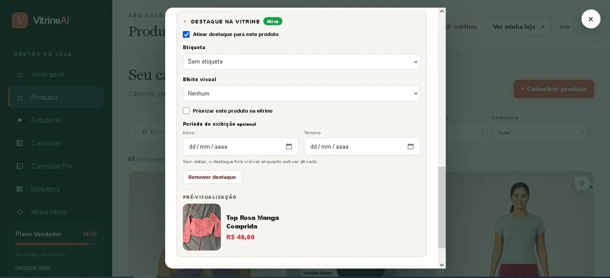
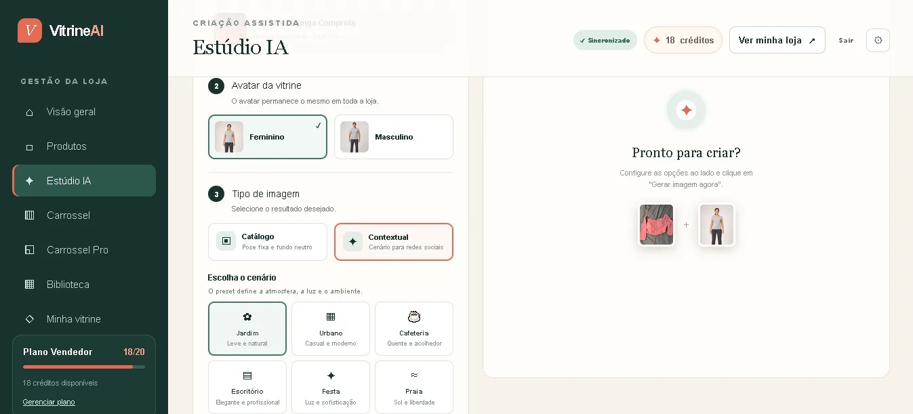
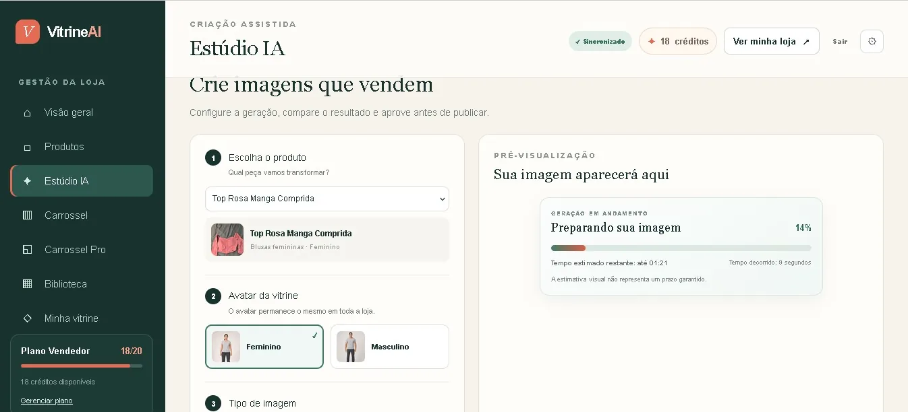
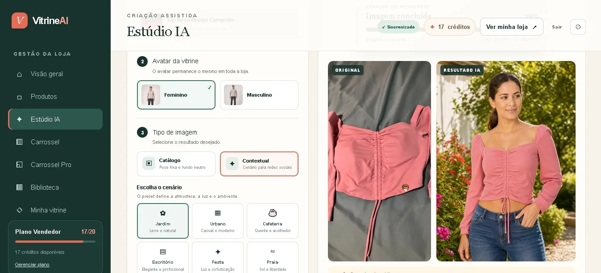
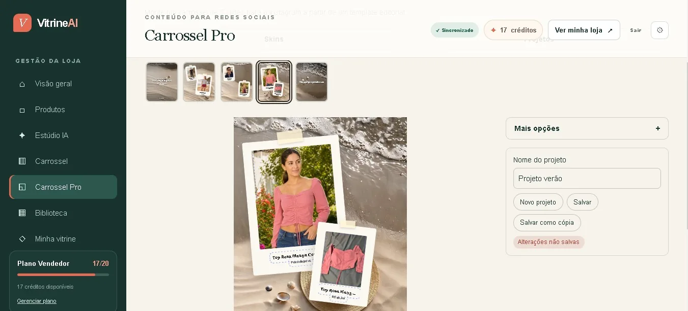
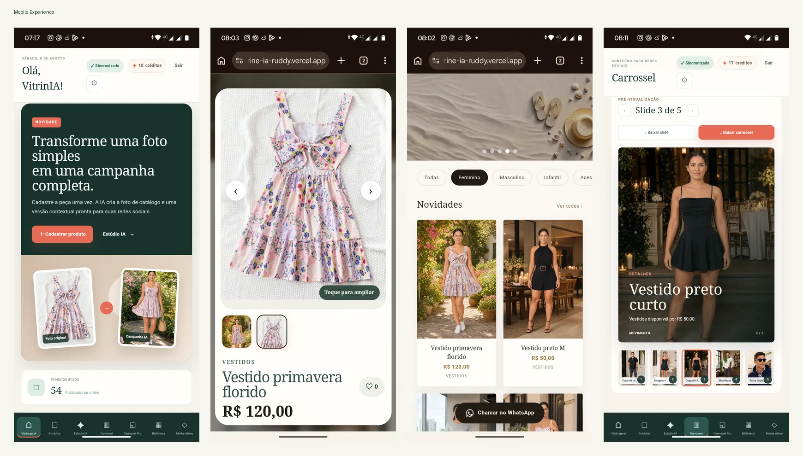

# Modallia

### AI-Powered Fashion Content & Catalog SaaS

Modallia is a SaaS platform designed to help fashion sellers manage products, generate commercial visuals with AI, publish responsive online storefronts, and create social media content from a single application.

> This repository is a public case study. The main application source code is private because Modallia is a commercial product.

## Visual Evidence

### Dashboard

### Product Management

### AI Studio

### AI Generation Workflow

### Original vs AI Result

### Public Storefront

### Product Detail

### Carousel Pro

### Mobile Experience

A complete screen map is also available in [`docs/visual-evidence.md`](docs/visual-evidence.md).
## Overview

The platform combines product management, authentication, AI-powered image generation, AI-assisted product descriptions, responsive public storefronts, social media content tools, image management, generation credits and production deployment.

## Featured Workflows

### Product management
Users can register products, define audience and category, add descriptions, configure publication behavior and manage product information from the dashboard.

### AI Studio
Users select a product, define the generation context, follow progress and compare the original input with the AI-generated result before approval.

### Public storefront
Products are published in a responsive storefront with category navigation, promotional sections, image galleries, detail views and WhatsApp-driven conversion flows.

### Social media content
Carousel and Carousel Pro transform product visuals into reusable promotional assets.

### Responsive experience
Both the internal dashboard and public storefront were adapted for desktop and mobile usage.

## My Role

- product planning and requirements definition;
- AI-assisted full-stack development;
- frontend implementation;
- Supabase integration;
- authentication and database workflows;
- AI/API integration;
- responsive UX refinement;
- debugging and functional testing;
- security improvements;
- production deployment.

## Tech Stack

Next.js • React • JavaScript • Supabase • PostgreSQL / SQL • OpenAI API • Vercel • Git / GitHub

## Key Challenges

### Multi-user data isolation
Separating user-owned data while keeping selected storefront information publicly accessible.

### Public and authenticated workflows
Supporting protected dashboard functionality alongside public customer-facing storefronts.

### AI generation workflow
Managing external AI requests, generation status, failures, retries and user feedback.

### Credit management
Keeping AI generation usage synchronized with the platform's credit system.

### Image lifecycle
Managing original and AI-generated images across creation, publication and deletion workflows.

### Responsive UX
Adapting complex product, AI and content creation workflows for desktop and mobile devices.

## Result

The project resulted in a functional SaaS application deployed to production, combining product management, AI-powered content generation, public storefronts and social media tools.

## Skills Demonstrated

Next.js • React • Supabase • SQL • Authentication • APIs • AI Integration • Responsive Design • SaaS Development • Debugging • Testing • Vercel

## Source Code

The production source code is kept private because Modallia is an active commercial product.
